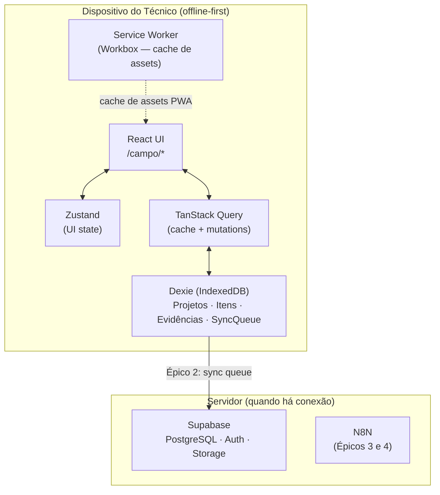
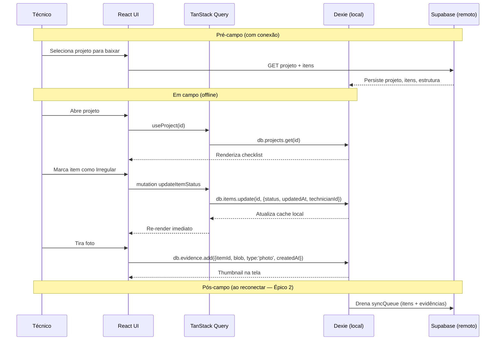

# Technical Design — Épico 1: Campo e Vistoria Offline

**Status:** Aprovado
**Última update:** 12/06/2026

---

## 1. Arquitetura

PWA React com duas áreas separadas — `/campo` (offline-first, tablet) e `/plataforma` (online, desktop). Documento cobre fase de fundação e Épico 1.

**Premissa:** IndexedDB é fonte de verdade em campo. Estado React deriva do banco local — nunca o contrário. Dados nascem no Dexie e sobem ao Supabase apenas na sync (Épico 2).



### Fluxo de dados



---

## 2. Stack

### Adotado

| Camada               | Tecnologia                | Alternativa descartada | Motivo                                                                                              |
| -------------------- | ------------------------- | ---------------------- | --------------------------------------------------------------------------------------------------- |
| Build                | Vite                      | Next.js                | Next.js conflita com PWA offline-first; Server Components são atrito para `/campo` 100% client-side |
| PWA                  | vite-plugin-pwa           | Workbox manual         | Abstrai SW e Manifest sem config; suficiente para MVP                                               |
| Linguagem            | TypeScript                | JavaScript             | Custo zero; ganho alto com schema complexo (itens, evidências, sync queue)                          |
| Roteamento           | React Router v6           | —                      | Conhecido pelo time; suporte nativo a layouts aninhados                                             |
| UI                   | shadcn/ui + Tailwind      | MUI / Chakra           | Componentes copiados no projeto (sem dependência de versão); mobile-friendly                        |
| Estado de UI         | Zustand                   | Context API            | Evita re-renders em listas longas; setup de 5 min                                                   |
| Dados (server)       | TanStack Query + Supabase | —                      | Mesma interface para IndexedDB e Supabase; troca transparente de fonte                              |
| Dados (local)        | TanStack Query + Dexie    | localStorage           | IndexedDB sem limite prático; Dexie melhor DX + TS                                                  |
| PDF                  | @react-pdf/renderer       | Puppeteer              | Único que roda no cliente sem servidor — essencial para offline                                     |
| Auth                 | Supabase Auth             | Auth própria           | JWT persiste em localStorage; técnico loga uma vez e app funciona offline                           |
| Banco (plataforma)   | Supabase PostgreSQL       | API dedicada           | CRUD direto do front via supabase-js; sem infra adicional                                           |
| Storage (fotos/PDFs) | Supabase Storage          | S3 direto              | Integrado ao ecossistema Supabase; sem infra adicional                                              |

### Descartado

| Item                     | Motivo                                                                 |
| ------------------------ | ---------------------------------------------------------------------- |
| Next.js                  | Server Components conflita com PWA offline-first; `/campo` 100% client |
| Monorepo (Turborepo/Nx)  | Dois devs, um repo, overhead desnecessário no MVP                      |
| Testes E2E (Playwright)  | Útil, fora desta fase                                                  |
| Storybook                | Luxo no MVP                                                            |
| React Native / Expo      | PRD descartou; PWA suficiente para tablet                              |
| API dedicada (Node/Nest) | Supabase resolve CRUD, Auth e Storage sem servidor                     |

---

## 3. Estrutura de Pastas

```
vistoria-app/
├── public/
│   └── icons/                  # Ícones PWA (192x192, 512x512)
├── src/
│   ├── campo/                  # Área offline-first
│   │   ├── pages/
│   │   │   ├── ProjetosPage.tsx          # Lista de projetos disponíveis
│   │   │   ├── VistoriaPage.tsx          # Tela principal de execução
│   │   │   ├── ItemDetailPage.tsx        # Detalhe de item + evidências
│   │   │   └── ResumoVistoriaPage.tsx    # Sumário antes de encerrar
│   │   ├── components/
│   │   │   ├── ChecklistItem.tsx         # Card de item com status
│   │   │   ├── StatusSelector.tsx        # Botões Regular/Irregular/Ausente/Pendente
│   │   │   ├── EvidenceCapture.tsx       # Câmera + upload + lista de thumbnails
│   │   │   ├── ProgressBar.tsx           # Progresso X/Y itens
│   │   │   ├── LocationGroup.tsx         # Agrupamento por localização (andar / cômodo / ala)
│   │   │   ├── ExtraItemForm.tsx         # Formulário de item adicional
│   │   │   └── SyncStatusBadge.tsx       # Indicador online/offline
│   │   ├── hooks/
│   │   │   ├── useProject.ts             # Carrega projeto do IndexedDB
│   │   │   ├── useItems.ts               # Lista e filtra itens por projeto/localização
│   │   │   ├── useItemMutations.ts       # update status, soft delete, add extra
│   │   │   ├── useEvidence.ts            # CRUD de evidências (foto/vídeo/comentário)
│   │   │   └── useVistoriaProgress.ts    # Contadores e validações de encerramento
│   │   └── CampoLayout.tsx               # Layout base offline (header + nav)
│   │
│   ├── plataforma/             # Área online (Épico 3)
│   │   ├── pages/
│   │   ├── components/
│   │   └── hooks/
│   │
│   ├── shared/                 # Compartilhado entre /campo e /plataforma
│   │   ├── components/
│   │   │   ├── Button.tsx
│   │   │   ├── Modal.tsx
│   │   │   └── Toast.tsx
│   │   ├── db/
│   │   │   ├── dexie.ts         # Schema e instância do banco local
│   │   │   └── supabase.ts      # Cliente Supabase
│   │   ├── types/
│   │   │   └── index.ts         # Tipos e interfaces compartilhados
│   │   └── utils/
│   │       ├── compressImage.ts  # browser-image-compression wrapper
│   │       └── formatDate.ts
│   │
│   ├── main.tsx
│   └── router.tsx
│
├── vite.config.ts
├── tailwind.config.ts
└── tsconfig.json
```

---

## 4. Roteamento

```tsx
// src/router.tsx
<Routes>
  <Route path="/" element={<Navigate to="/campo" />} />

  {/* Área campo — offline-first, auth persiste do último login */}
  <Route path="/campo" element={<CampoLayout />}>
    <Route index element={<ProjetosPage />} />
    <Route path="vistoria/:projectId" element={<VistoriaPage />} />
    <Route path="vistoria/:projectId/item/:itemId" element={<ItemDetailPage />} />
    <Route path="vistoria/:projectId/resumo" element={<ResumoVistoriaPage />} />
  </Route>

  {/* Área plataforma — online, auth obrigatória (Épico 3) */}
  <Route path="/plataforma" element={<PlataformaLayout />}>
    {/* ... */}
  </Route>
</Routes>
```

**Regras:**

- `/campo` — não redireciona se JWT expirou; exibe `SyncStatusBadge` com aviso; bloqueia só sync.
- `/plataforma` — guard obrigatório; redireciona para `/login` se não autenticado.

---

## 5. Modelos de Dados

### 5.1 Schema Dexie (IndexedDB)

```typescript
// src/shared/db/dexie.ts
import Dexie, { type EntityTable } from 'dexie'

export interface Project {
  id: string // UUID (do Supabase ou gerado localmente)
  name: string
  address: string
  status: 'pending' | 'in_progress' | 'completed'
  downloadedAt: Date
  syncedAt: Date | null
}

export interface Location {
  id: string
  projectId: string
  name: string
  type: 'building' | 'floor' | 'room' | 'wing' | 'basement' | 'area' | 'other'
  parentId: string | null
  order: number
}

export interface Item {
  id: string
  projectId: string
  locationId: string | null // null para projetos sem localização definida
  description: string
  category: ItemCategory
  normativeRef: string | null // ex.: "IT-16 §4.2"
  status: ItemStatus
  isExtra: boolean // true = adicionado pelo técnico em campo
  deletedAt: Date | null // soft delete
  deletedById: string | null
  updatedAt: Date
  technicianId: string
}

export type ItemStatus = 'pending' | 'regular' | 'irregular' | 'absent'
export type ItemCategory =
  | 'extinguisher'
  | 'emergency_exit'
  | 'lighting'
  | 'sprinkler'
  | 'alarm'
  | 'other'

export interface Evidence {
  id: string
  itemId: string
  type: 'photo' | 'video' | 'comment'
  blob: Blob | null // null para type='comment'
  comment: string | null // null para type='photo'|'video'
  createdAt: Date
  technicianId: string
}

export interface SyncQueueEntry {
  id?: number // auto-increment
  type: 'item_update' | 'evidence_add' | 'item_add' | 'item_delete'
  payload: string // JSON serializado
  attempts: number
  createdAt: Date
}

class VistoriaDB extends Dexie {
  projects!: EntityTable<Project, 'id'>
  locations!: EntityTable<Location, 'id'>
  items!: EntityTable<Item, 'id'>
  evidence!: EntityTable<Evidence, 'id'>
  syncQueue!: EntityTable<SyncQueueEntry, 'id'>

  constructor() {
    super('VistoriaDB')
    // initial schema: locations + locationId on items
    this.version(1).stores({
      projects: 'id, status, downloadedAt',
      locations: 'id, projectId, type, parentId, order',
      items: 'id, projectId, locationId, status, isExtra, deletedAt',
      evidence: 'id, itemId, type, createdAt',
      syncQueue: '++id, type, attempts, createdAt',
    })
  }
}

export const db = new VistoriaDB()
```

> **Blobs:** fotos e vídeos salvos como `Blob` no IndexedDB — sem base64. Evita 3× mais espaço; compatível com API de câmera do browser.

### 5.2 Carregamento de Projeto via Supabase (RF-10)

Busca projeto + localizações + itens em operação única; persiste em transação atômica no Dexie.

```typescript
// src/campo/hooks/useProjectSync.ts
async function loadProjectToDevice(projectId: string): Promise<void> {
  const { data: project } = await supabase
    .from('projects')
    .select(`*, locations(*, items(*))`)
    .eq('id', projectId)
    .single()

  await db.transaction('rw', [db.projects, db.locations, db.items], async () => {
    await db.projects.put({
      id: project.id,
      name: project.name,
      address: project.address,
      status: 'pending',
      downloadedAt: new Date(),
      syncedAt: null,
    })
    await db.locations.bulkPut(project.locations.map((l) => ({ ...l, projectId: project.id })))
    await db.items.bulkPut(
      project.locations.flatMap((l) =>
        (l.items || []).map((i) => ({
          ...i,
          projectId: project.id,
          locationId: l.id, // null se projeto sem localização
          status: 'pending' as ItemStatus,
          isExtra: false,
          deletedAt: null,
          deletedById: null,
          updatedAt: new Date(),
          technicianId: getCurrentUserId(),
        }))
      )
    )
  })
}
```

**Projetos sem localização:** sem `locations` na resposta, itens persistem com `locationId: null`. `VistoriaPage` renderiza lista única sem `LocationGroup`.

**Política de atualização:** ao recarregar projeto existente, apenas estrutura original é atualizada. Dados de campo (status, evidências, itens extras) **nunca são sobrescritos**.

### 5.3 Schema Supabase (PostgreSQL)

```sql
CREATE TABLE projects (
  id          UUID PRIMARY KEY DEFAULT gen_random_uuid(),
  name        TEXT NOT NULL,
  address     TEXT,
  status      TEXT NOT NULL DEFAULT 'pending',
  created_by  UUID REFERENCES auth.users(id),
  created_at  TIMESTAMPTZ DEFAULT now()
);

CREATE TABLE locations (
  id          UUID PRIMARY KEY DEFAULT gen_random_uuid(),
  project_id  UUID REFERENCES projects(id) ON DELETE CASCADE,
  name        TEXT NOT NULL,
  type        TEXT NOT NULL DEFAULT 'room',
  parent_id   UUID,
  "order"     INT NOT NULL DEFAULT 0,
  path        UUID[] DEFAULT '{}'
);

CREATE TABLE items (
  id              UUID PRIMARY KEY DEFAULT gen_random_uuid(),
  project_id      UUID REFERENCES projects(id) ON DELETE CASCADE,
  location_id     UUID REFERENCES locations(id) ON DELETE CASCADE,
  description     TEXT NOT NULL,
  category        TEXT NOT NULL,
  normative_ref   TEXT,
  status          TEXT NOT NULL DEFAULT 'pending',
  is_extra        BOOLEAN DEFAULT false,
  deleted_at      TIMESTAMPTZ,
  deleted_by      UUID REFERENCES auth.users(id),
  updated_at      TIMESTAMPTZ DEFAULT now(),
  technician_id   UUID REFERENCES auth.users(id)
);

CREATE TABLE evidence (
  id              UUID PRIMARY KEY DEFAULT gen_random_uuid(),
  item_id         UUID REFERENCES items(id) ON DELETE CASCADE,
  type            TEXT NOT NULL,   -- 'photo' | 'video' | 'comment'
  storage_path    TEXT,            -- path no Supabase Storage
  comment         TEXT,
  created_at      TIMESTAMPTZ DEFAULT now(),
  technician_id   UUID REFERENCES auth.users(id)
);
```

**RLS:**

```sql
-- Todos os técnicos autenticados veem e operam todos os projetos da organização
CREATE POLICY "all_authenticated_read_projects" ON projects
  FOR SELECT USING (auth.role() = 'authenticated');

CREATE POLICY "all_authenticated_read_locations" ON locations
  FOR SELECT USING (auth.role() = 'authenticated');

CREATE POLICY "all_authenticated_read_items" ON items
  FOR SELECT USING (auth.role() = 'authenticated');

CREATE POLICY "all_authenticated_read_evidence" ON evidence
  FOR SELECT USING (auth.role() = 'authenticated');

CREATE POLICY "authenticated_write_items" ON items
  FOR INSERT WITH CHECK (auth.role() = 'authenticated');

CREATE POLICY "authenticated_update_items" ON items
  FOR UPDATE USING (auth.role() = 'authenticated');
```

> Todos os projetos visíveis para todos os técnicos autenticados — sem filtro por atribuição. Controle 100% via RLS, sem lógica no front.

---

## 6. Componentes

### `StatusSelector`

- **Propósito:** 4 botões de status com feedback visual, dispara mutation.
- **Localização:** `src/campo/components/StatusSelector.tsx`
- **Interface:**
  ```typescript
  interface StatusSelectorProps {
    itemId: string
    currentStatus: ItemStatus
    onChange: (status: ItemStatus) => void
    disabled?: boolean
  }
  ```
- **UI:** botões ≥ 48×48px; cores fixas — Regular (verde), Irregular (vermelho), Ausente (cinza), Pendente (amarelo).

### `EvidenceCapture`

- **Propósito:** Abre câmera nativa, comprime imagem, salva Blob no Dexie, exibe thumbnails.
- **Localização:** `src/campo/components/EvidenceCapture.tsx`
- **Interface:**
  ```typescript
  interface EvidenceCaptureProps {
    itemId: string
    maxPhotos?: number // default: 10
    maxVideoSeconds?: number // default: 60
  }
  ```
- **Fluxo:**
  1. `<input type="file" accept="image/*" capture="environment">` — câmera traseira
  2. `compressImage(file, { maxSizeMB: 1 })`
  3. `db.evidence.add({ itemId, blob: compressed, type: 'photo', createdAt: new Date(), technicianId })`
  4. `useLiveQuery` para thumbnails em tempo real
- **Dep:** `browser-image-compression`

### `useVistoriaProgress`

- **Propósito:** Progresso e validações de encerramento.
- **Localização:** `src/campo/hooks/useVistoriaProgress.ts`
- **Interface:**

  ```typescript
  interface VistoriaProgress {
    total: number
    completed: number // status !== 'pending' && deletedAt === null
    pendingCount: number
    irregularWithoutPhoto: string[] // ids dos itens bloqueantes
    canFinish: boolean // pendingCount === 0 && irregularWithoutPhoto.length === 0
    percentComplete: number
  }

  function useVistoriaProgress(projectId: string): VistoriaProgress
  ```

- **Impl:** `useLiveQuery` — reativo a qualquer mudança no banco local.

### `SyncStatusBadge`

- **Propósito:** Indicador persistente de online/offline + itens na fila de sync.
- **Localização:** `src/campo/components/SyncStatusBadge.tsx`
- **Estados:**
  - 🟢 Online — dados salvos localmente (sync no Épico 2)
  - 🟡 Online — X itens na fila de sync
  - 🔴 Offline — dados salvos localmente
- **Impl:** `navigator.onLine` + `window.addEventListener('online'|'offline')` + `useLiveQuery(db.syncQueue.count())`

### `ExtraItemForm`

- **Propósito:** Modal para técnico adicionar item fora do checklist.
- **Localização:** `src/campo/components/ExtraItemForm.tsx`
- **Interface:**
  ```typescript
  interface ExtraItemFormProps {
    projectId: string
    locationId: string | null // null para projetos sem localização
    onSuccess: (newItemId: string) => void
    onCancel: () => void
  }
  ```
- **Campos:** descrição (obrigatório), categoria (select), referência normativa (opcional).
- **Persiste:** `db.items.add({ ..., isExtra: true, status: 'pending', technicianId })` + enfileira na `syncQueue`.

---

## 7. Compressão de Mídia

```typescript
// src/shared/utils/compressImage.ts
import imageCompression from 'browser-image-compression'

export async function compressImage(file: File): Promise<Blob> {
  return imageCompression(file, {
    maxSizeMB: 1,
    maxWidthOrHeight: 1920,
    useWebWorker: true, // não bloqueia UI thread
    fileType: 'image/jpeg',
  })
}
```

**Vídeos:** sem compressão no MVP. Limite: 60s/captura. Tamanho estimado: ~30–80 MB por vídeo em 1080p; monitorar via RT-06.

---

## 8. Service Worker (PWA)

```typescript
// vite.config.ts
import { defineConfig } from 'vite'
import react from '@vitejs/plugin-react'
import { VitePWA } from 'vite-plugin-pwa'

export default defineConfig({
  plugins: [
    react(),
    VitePWA({
      registerType: 'autoUpdate',
      workbox: {
        globPatterns: ['**/*.{js,css,html,ico,png,svg,woff2}'],
        runtimeCaching: [
          {
            urlPattern: /\/campo\/.*/,
            handler: 'CacheFirst',
            options: { cacheName: 'campo-assets' },
          },
        ],
      },
      manifest: {
        name: 'Vistoria Técnica',
        short_name: 'Vistoria',
        start_url: '/campo',
        display: 'standalone',
        background_color: '#ffffff',
        theme_color: '#1e40af',
        icons: [
          { src: '/icons/icon-192.png', sizes: '192x192', type: 'image/png' },
          { src: '/icons/icon-512.png', sizes: '512x512', type: 'image/png' },
        ],
      },
    }),
  ],
})
```

**Cache:**

- Assets estáticos (JS, CSS, ícones): `CacheFirst`.
- Requests Supabase: `NetworkFirst` com fallback — só `/plataforma`.
- Dados de vistoria: 100% IndexedDB, fora do SW.

---

## 9. Tratamento de Erros

| Cenário                                    | Tratamento                                                     | O que o usuário vê                                                   |
| ------------------------------------------ | -------------------------------------------------------------- | -------------------------------------------------------------------- |
| Falha ao salvar status no Dexie            | Try/catch + retry automático (3×); se persistir, toast de erro | "Erro ao salvar — tente novamente" com botão de retry                |
| Falha ao comprimir foto                    | Salva original se < 5MB; rejeita se > 5MB                      | "Foto muito grande — tente com resolução menor"                      |
| Falha ao acessar câmera (permissão negada) | Fallback para seleção de galeria                               | Ícone de galeria substitui câmera; toast explicativo                 |
| Token JWT expirado (offline)               | App funciona; bloqueia só ações que exigem rede                | Badge laranja "Sessão expirada — reconecte para sincronizar"         |
| Projeto corrompido no IndexedDB            | Detecta na abertura; remove entrada; exibe erro                | "Projeto inválido — faça o download novamente"                       |
| IndexedDB cheio (≥ quota)                  | Captura `QuotaExceededError`; aviso proativo quando > 80%      | Alerta amarelo: "Espaço local quase cheio — sincronize para liberar" |

---

## 10. Requisitos Técnicos

`RT-XX` = rastreabilidade. **DEVE** = obrigatório; **NÃO DEVE** = proibido; **DEVERIA** = recomendado.

---

### RT-01–12 — Armazenamento Local

#### Persistência

| ID        | Requisito                                                                                                                                        |
| --------- | ------------------------------------------------------------------------------------------------------------------------------------------------ |
| **RT-01** | O app **DEVE** solicitar armazenamento persistente (`navigator.storage.persist()`) na primeira execução, antes de qualquer captura de evidência. |
| **RT-02** | O app **DEVE** verificar status de persistência (`navigator.storage.persisted()`) ao iniciar cada vistoria.                                      |
| **RT-03** | Se persistência negada, o app **DEVE** exibir aviso de risco de perda de dados e orientar instalação do PWA.                                     |
| **RT-04** | O app **DEVE** incentivar instalação como PWA para garantir persistência automática em navegadores compatíveis.                                  |

#### Quota

| ID        | Requisito                                                                                                   |
| --------- | ----------------------------------------------------------------------------------------------------------- |
| **RT-05** | O app **DEVE** consultar quota (`navigator.storage.estimate()`) antes de cada captura de mídia.             |
| **RT-06** | O app **DEVE** exibir indicador contínuo de espaço utilizado vs. disponível durante a vistoria.             |
| **RT-07** | O app **DEVE** bloquear novas capturas quando espaço livre < dobro do tamanho estimado da próxima mídia.    |
| **RT-08** | O app **DEVE** capturar `QuotaExceededError` e oferecer: sync forçada, limpeza de cache, exportação manual. |

#### Tecnologia

| ID        | Requisito                                                                                                  |
| --------- | ---------------------------------------------------------------------------------------------------------- |
| **RT-09** | O app **DEVE** usar IndexedDB como mecanismo principal (via Dexie.js, schema seção 5).                     |
| **RT-10** | Mídias **DEVEM** ser armazenadas como `Blob` — **nunca** base64.                                           |
| **RT-11** | O app **NÃO DEVE** usar `localStorage` para dados de vistoria ou mídias (limite 5–10 MB, síncrono).        |
| **RT-12** | Schema local **DEVE** separar metadados, mídias e sync queue em tabelas distintas (`VistoriaDB`, seção 5). |

---

### RT-13–22 — Captura de Mídias

#### Compressão

| ID        | Requisito                                                                                 |
| --------- | ----------------------------------------------------------------------------------------- |
| **RT-13** | Fotos **DEVEM** ser redimensionadas para no máximo 1920×1440px antes do armazenamento.    |
| **RT-14** | Fotos **DEVEM** ser recomprimidas em JPEG com qualidade 75–85%.                           |
| **RT-15** | Vídeos **DEVEM** ter resolução máxima 1080p e bitrate controlado via `MediaRecorder` API. |
| **RT-16** | Vídeos **DEVEM** ter duração máxima configurável — padrão: 60s/captura.                   |
| **RT-17** | O app **DEVE** exibir tamanho estimado após cada captura, antes da confirmação.           |

#### Metadados Obrigatórios

| ID        | Requisito                                                                                                                                                 |
| --------- | --------------------------------------------------------------------------------------------------------------------------------------------------------- |
| **RT-18** | Cada mídia **DEVE** armazenar: ID da vistoria, ID do item, coordenadas GPS, timestamp ISO 8601, ID do técnico, tipo/MIME, tamanho em bytes, hash SHA-256. |
| **RT-19** | Se GPS indisponível, o app **DEVE** registrar ausência e permitir entrada manual da localização aproximada.                                               |

#### Integridade Forense

| ID        | Requisito                                                                                       |
| --------- | ----------------------------------------------------------------------------------------------- |
| **RT-20** | Após cada captura, o app **DEVE** calcular hash SHA-256 do binário e armazená-lo junto à mídia. |
| **RT-21** | Hash **DEVE** ser transmitido com a mídia no upload para verificação no servidor.               |
| **RT-22** | O app **NÃO DEVE** permitir edição, recorte ou alteração de mídias após captura.                |

---

### RT-23–33 — Sincronização

#### Estratégia Incremental

| ID        | Requisito                                                                                                   |
| --------- | ----------------------------------------------------------------------------------------------------------- |
| **RT-23** | O app **DEVE** manter fila de upload persistente no IndexedDB (`syncQueue`), processada independente da UI. |
| **RT-24** | Cada mídia **DEVE** ser enfileirada imediatamente após captura, sem aguardar encerramento da vistoria.      |
| **RT-25** | O app **DEVE** iniciar uploads ao detectar conectividade (`navigator.onLine` / evento `online`).            |
| **RT-26** | Após upload confirmado, o `Blob` local **DEVE** ser removido, mantendo apenas metadados e hash.             |

#### Resiliência

| ID        | Requisito                                                                                              |
| --------- | ------------------------------------------------------------------------------------------------------ |
| **RT-27** | Retry com backoff exponencial: 5s → 15s → 60s → 5min → 30min.                                          |
| **RT-28** | O app **DEVE** usar Background Sync API (`SyncManager`) quando disponível.                             |
| **RT-29** | Upload de vídeos **DEVE** usar chunks (upload resumível) para tolerar quedas de conexão.               |
| **RT-30** | O app **DEVE** registrar histórico de tentativas (timestamp, código de erro, mensagem) para auditoria. |

#### Confirmação

| ID        | Requisito                                                                                                 |
| --------- | --------------------------------------------------------------------------------------------------------- |
| **RT-31** | UI **DEVE** indicar status de cada mídia: capturada / na fila / enviando / confirmada / falha.            |
| **RT-32** | O app **DEVE** bloquear encerramento formal com mídias não sincronizadas, exigindo confirmação explícita. |
| **RT-33** | O app **DEVE** exibir relatório final: mídias capturadas vs. confirmadas no servidor.                     |

---

### RT-34–41 — Compatibilidade

#### Navegadores

| ID        | Requisito                                                                                                                           |
| --------- | ----------------------------------------------------------------------------------------------------------------------------------- |
| **RT-34** | Suporte oficial: Chrome/Chromium 100+ (Android e desktop), Edge 100+ (desktop), Safari 16+ (iOS e macOS) — limitações documentadas. |
| **RT-35** | O app **DEVE** detectar navegador e exibir avisos de limitações conhecidas, especialmente Safari iOS.                               |

#### iOS/Safari

| ID        | Requisito                                                                                                                 |
| --------- | ------------------------------------------------------------------------------------------------------------------------- |
| **RT-36** | Em iOS, o app **DEVE** adotar sync agressiva (upload imediato ao conectar), tratando armazenamento local como temporário. |
| **RT-37** | Em iOS, o app **DEVE** recomendar instalação na tela inicial e uso com conexão sempre que possível.                       |
| **RT-38** | O app **DEVE** alertar sobre ITP do Safari (dados apagados após 7 dias sem acesso).                                       |

#### PWA

| ID        | Requisito                                                                                               |
| --------- | ------------------------------------------------------------------------------------------------------- |
| **RT-39** | O app **DEVE** fornecer `manifest.json` válido com ícones, nome, cores e modo `standalone`.             |
| **RT-40** | O app **DEVE** registrar Service Worker para offline completo (Workbox, seção 8).                       |
| **RT-41** | Prompt de instalação (`beforeinstallprompt`) **DEVE** aparecer após o primeiro login — não na abertura. |

---

### RT-42–46 — Contingência

#### Exportação Manual

| ID        | Requisito                                                                                              |
| --------- | ------------------------------------------------------------------------------------------------------ |
| **RT-42** | O app **DEVE** oferecer exportação de mídias e metadados via File System Access API quando disponível. |
| **RT-43** | Sem File System Access API, o app **DEVE** permitir download individual ou ZIP.                        |
| **RT-44** | Exportação **DEVE** incluir manifesto com hashes SHA-256 de todas as mídias.                           |

#### Recuperação

| ID        | Requisito                                                                                        |
| --------- | ------------------------------------------------------------------------------------------------ |
| **RT-45** | Metadados **DEVEM** ser preservados localmente mesmo após remoção de mídias já sincronizadas.    |
| **RT-46** | O app **DEVE** permitir consulta a vistorias finalizadas e re-download de mídias, mediante auth. |

---

### RT-47–50 — Segurança e Privacidade

| ID        | Requisito                                                                                                           |
| --------- | ------------------------------------------------------------------------------------------------------------------- |
| **RT-47** | Dados locais **DEVEM** ser vinculados ao técnico autenticado, com bloqueio após logout.                             |
| **RT-48** | O app **DEVE** oferecer criptografia em repouso das mídias no IndexedDB (Web Crypto API, chave derivada da sessão). |
| **RT-49** | O app **NÃO DEVE** expor blobs em URLs públicas fora do contexto da aplicação.                                      |
| **RT-50** | Toda comunicação com servidor **DEVE** ocorrer via HTTPS com TLS 1.2+.                                              |

---

### RT-51–52 — Telemetria

| ID        | Requisito                                                                                                                                                                              |
| --------- | -------------------------------------------------------------------------------------------------------------------------------------------------------------------------------------- |
| **RT-51** | O app **DEVE** registrar (com consentimento): concessão/negação de persistência, `QuotaExceededError`, falhas de upload, tempo captura→confirmação, detecção de perda de dados locais. |
| **RT-52** | O app **DEVE** oferecer painel administrativo de status de sync das vistorias em campo.                                                                                                |

---

### RT-53–54 — Testes

| ID        | Requisito                                                                                                                                                                                            |
| --------- | ---------------------------------------------------------------------------------------------------------------------------------------------------------------------------------------------------- |
| **RT-53** | Testar em: sem cobertura de rede (subsolos, áreas industriais), armazenamento próximo do limite (< 1 GB livre), sessões longas (> 2h, 50+ mídias), troca de app, bloqueio de tela e reinicialização. |
| **RT-54** | Homologação **DEVE** incluir teste de pressão de armazenamento em iOS Safari e Android Chrome.                                                                                                       |

---

### Anexo A — Glossário

| Termo                         | Definição                                                                          |
| ----------------------------- | ---------------------------------------------------------------------------------- |
| **PWA**                       | App web instalável com suporte a offline                                           |
| **IndexedDB**                 | Banco não-relacional, transacional e persistente embutido nos browsers             |
| **Pressão de espaço**         | Browser libera dados "best-effort" sem aviso ao usuário                            |
| **Armazenamento persistente** | Dados só apagados por ação explícita do usuário                                    |
| **Background Sync API**       | API para SW retomar sync em segundo plano                                          |
| **SHA-256**                   | Hash criptográfico para integridade de arquivos                                    |
| **ITP**                       | Intelligent Tracking Prevention — Safari apaga dados locais após 7 dias sem acesso |

---

## 11. Setup

```bash
# Scaffold
npm create vite@latest vistoria-app -- --template react-ts
cd vistoria-app

# Core
npm install react-router-dom zustand
npm install @tanstack/react-query @tanstack/react-query-devtools

# Supabase
npm install @supabase/supabase-js @supabase/auth-helpers-react

# Offline
npm install dexie dexie-react-hooks

# Mídia
npm install browser-image-compression

# PDF (Épico 4, instalar agora para evitar conflito de deps)
npm install @react-pdf/renderer

# UI
npm install -D tailwindcss @tailwindcss/vite
npx shadcn@latest init

# PWA
npm install -D vite-plugin-pwa

# Validação
npm install zod

# Dev
npm install -D @types/react @types/react-dom typescript eslint prettier
```

**Env:**

```bash
# .env.local
VITE_SUPABASE_URL=https://[project].supabase.co
VITE_SUPABASE_ANON_KEY=[anon-key]
```

---

## 12. Decisões Não-Óbvias

| Decisão                        | Escolha                                           | Razão                                                                                                 |
| ------------------------------ | ------------------------------------------------- | ----------------------------------------------------------------------------------------------------- |
| Fonte da verdade em campo      | IndexedDB (Dexie) — não estado React              | Dados sobrevivem a crashes e reloads; React deriva do banco via `useLiveQuery`                        |
| Blobs em vez de base64         | `Blob` nativo no IndexedDB                        | Base64 infla 33%; Blob compatível com `URL.createObjectURL` para thumbnails                           |
| Zustand só para UI state       | Status de modais, seleção atual, flags de loading | Dados de negócio ficam no Dexie + TanStack Query; Zustand não persiste entre sessões                  |
| Zod na resposta do Supabase    | Validação em runtime da estrutura recebida        | Resposta incompleta detectada antes de contaminar o Dexie; type safety no boundary API → schema local |
| `autoUpdate` no Service Worker | PWA atualiza silenciosamente                      | Técnico em campo não vê prompt; próxima abertura carrega versão nova                                  |
| RLS em vez de filtros no front | Controle de acesso 100% no banco                  | Elimina superfície de ataque de manipulação no client; roles opacos ao front                          |

---

## Próximo passo

> `/taskify` — quebrar RFs em tarefas atômicas com dependências, estimativas e critérios de verificação.
