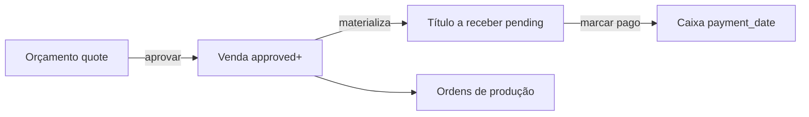

# Fluxo de caixa e dashboard — Fourlab ERP

Manual operacional para sócios e time. Alinha a leitura do **Início** (`/inicio`) com o modelo financeiro achatado.

## Glossário

| Termo | Significado |
| --- | --- |
| **Orçamento** | Pedido em `orders.status = quote` — ainda não é venda |
| **Venda** | Pedido `approved` ou posterior (`in_production`, `completed`, `delivered`), com `approval_date` |
| **OP** | Ordem de produção (`production_orders`) ligada a item do pedido |
| **Título** | Uma obrigação em `financial_titles` (a receber ou a pagar). **Um título = um pagamento** |
| **Caixa** | Dinheiro que entrou/saiu de fato (`status = paid` + `payment_date`) |

Parcelamento raro: criar **vários títulos** (ex. “Parcela 1/3”), não uma tabela de parcelas.

## O que cada bloco do dashboard mostra

### 1. Financeiro do mês (regime de caixa)

Timezone: **America/Sao_Paulo**, mês civil atual.

| Métrica | Entra | Não entra |
| --- | --- | --- |
| **Recebido** | títulos `receivable` + `paid` com `payment_date` no mês | títulos só emitidos / pending |
| **Pago** | títulos `payable` + `paid` com `payment_date` no mês | — |
| **Saldo** | Recebido − Pago | — |
| **Atrasados** | `overdue` **ou** `pending` com `due_date` &lt; hoje | `canceled`; pending com vencimento hoje ou futuro |

### 2. Vendas do mês + evolução (6 meses)

- Soma `orders.total_amount` com status `approved` / `in_production` / `completed` / `delivered`
- Filtra por **`approval_date`** (não `issue_date`)
- Exclui `quote`, `canceled` e pedidos sem `approval_date`
- Gráfico: últimos 6 meses (inclui o atual)

### 3. Funil de produção

Snapshot **atual** (não filtra mês): Aguardando → Em produção → Montagem → Concluído.  
`scrap` aparece só como número auxiliar.

### 4. Últimos orçamentos aprovados

Até 8 pedidos approved+, ordenados por `approval_date` desc: cliente, valor, data, status.

## Fechamento do mês (checklist)

1. Abrir **Início** e anotar Recebido / Pago / Saldo / Atrasados.
2. Conferir se **Vendas do mês** batem com pedidos aprovados no período (comercial ≠ caixa).
3. Revisar **atrasados**: cobrar ou remarcar `due_date` / pagar título.
4. Garantir que despesas do mês foram lançadas como títulos `payable` e marcadas `paid` quando saíram.
5. Olhar funil: OPs paradas em Aguardando / Em produção.
6. Guardar print ou anotar os quatro números para o histórico (seletor de mês virá depois).

## Como o título a receber nasce

- Venda **direta** ou **aprovação de orçamento** via RPCs de vendas (`create_sale` / `approve_order`) materializa título(s) conforme o plano de pagamento.
- Trigger de consistência: ao passar a `approved`, se ainda não houver título e houver plano → materializa; sem plano → cria 1 título `pending` (categoria **Vendas**).
- Seed deve manter categoria `Vendas` (`revenue`). Sem ela, a materialização falha.

## Casos-limite

| Caso | Comportamento |
| --- | --- |
| Cancelar pedido com título `pending` | Título vai para `canceled` |
| Cancelar com título já `paid` | Título pago **permanece** — ajuste manual |
| Alterar valor do pedido com 1 título `pending` | Valor do título acompanha |
| Vários títulos (parcelas) | Sync automático de valor **não** redistribui — cuidado |
| Sucata | Fora do funil principal |
| Pedido approved sem `approval_date` | Fora de vendas/lista (anomalia) |

## Fora deste manual

Telas de marcar título como pago, CRUD completo de despesas e drill-down do dashboard serão módulos separados. O Início é **somente leitura**.
